# Automatic Pill Dispenser
## Overview 
**Possible limits: Needing a 3D Printer and Soldering machine** 

Our project addresses the challenge that older adults with dementia or memory-related conditions face when trying to manage their medications independently. Many struggle to remember when to take their pills or whether they have already taken them, which can lead to missed doses or double-dosing. Based on this, our needs statement is that users require a system that not only organizes their medication clearly but also supports them in taking the correct pills at the correct time without relying heavily on a caregiver. To guide our design, we focused on three main principles: simplicity, reliability, and automation. The device must be easy to understand and use, consistently perform without errors, and reduce the need for memory through automated assistance. Success for our design would mean that the device can accurately stop at the correct compartment every time, dispense the correct pills, and remain easy for users to load and interact with. We plan to measure this through testing stopping accuracy, consistency over repeated rotations, and how easily a user can interact with the system. If the device does not meet these expectations, we will adjust key elements such as compartment spacing, magnet placement, or control logic to improve performance.

## Final Design Challenges and Lessons Learned

Our final CAD design aimed to create a rotating pill dispenser system similar to a Ferris wheel, where a circular 15-compartment wheel rotated inside a rectangular support structure. The design included 14 compartments for daily and nightly medication and one additional compartment serving as a refill or reminder section. To automate positioning, magnets were embedded into the rotating inner section, while Hall sensors connected to an Arduino system were intended to detect the magnets and stop the wheel at the correct compartment. The overall goal was to create a system that could reliably organize and dispense medication while supporting user independence and reducing medication errors.

However, during testing and evaluation of the final design, we encountered a major issue with the sensor-detection system. Because the wheel continuously rotated, the Hall sensors were not consistently able to detect every magnet as intended. Some magnets were detected successfully, while others were missed depending on alignment, spacing, and distance during rotation. This created inconsistency in stopping accuracy, which reduced the reliability of the dispensing mechanism. As a result, although the design successfully demonstrated the overall concept and functionality of the system, the final STL design was not fully reliable in practice and would require additional redesign iterations before being used as a dependable automated dispenser.

One major lesson learned from this project was the importance of sensor placement and detection range in rotating automated systems. For future improvements, we would recommend using larger magnets and increasing the overall scale of the design to improve the consistency of Hall sensor detection. Increasing spacing and improving alignment tolerance between components would likely make the stopping mechanism more reliable and improve overall system performance.

Below are the STL files for the final design in case anyone would like to experiment with or improve upon the project further. We also made the different design iterations and cycles public so others can see the progression of the project from early concepts to the final design. All CAD files, iterations, and design changes can be found on Onshape through the link attached below. Onshape is free to use, making it accessible for anyone interested in viewing, modifying, or building upon the project.

[Rectangular Outlier Box File ](https://github.com/cndekelengwe/ENGR11A-Design_Projects/blob/main/pill_dispenser/Rectangular%20box.stl)  
[Wheel Compartements for pills STL File ](https://github.com/cndekelengwe/ENGR11A-Design_Projects/blob/main/pill_dispenser/cycle%203%20-%20Part%201%20(1).stl)  
[Drop box](https://github.com/cndekelengwe/ENGR11A-Design_Projects/blob/main/pill_dispenser/drop%20box%20-%20Part%201.stl)  
[ONshape Public File](https://cad.onshape.com/documents/309217a32cb4d046a7bca957/w/9944779888e9e89e632aefbe/e/01b1d22fc2a453b275cd808a)  (PS - if the link is unclickable, then copy the link and paste in the search bar) 

## Step-by-Step Circuit Assembly Guide for the Automatic Pill Dispenser
**Necessary Items** 

Download Arduino or any compatible coding platform for arduino board. 

A small breadboard (you can use basically any breadboard as long as it accommodates the necessary design size) 

A couple of different jumper wires - link

A USB Printer Cable

An LED (depending on how much light you want,  get as many LEDs).

A motor - Gebildet 8pcs DC3V-12V DC Geared Motor, for Aircraft Toys/Robotic Body/Four-Wheel Drive Toy Car, Batch Number: Double Axis 1:48

2 regular wires
A soldering machine is not needed, but is suggested; it is commonly found in a library. 

A cable to connect the battery 

Resistor (higher than 222 ohms) 

A 9V battery clip

DRV8833 Dual H-Bridge DC Motor Driver Module H

Link for Recommended Purchases - https://docs.google.com/document/d/1mJEsCzdOZILXJwwprC4P9GmpTi7Cr48AwGSw3bIJmXU/edit?tab=t.0 

**Step-By_Step Processs** 

1. For every Hall sensor, use male-to-female jumper wires to connect them to the Hall sensor and buzzer, remembering which wire colors go where (look at the picture for reference). 

  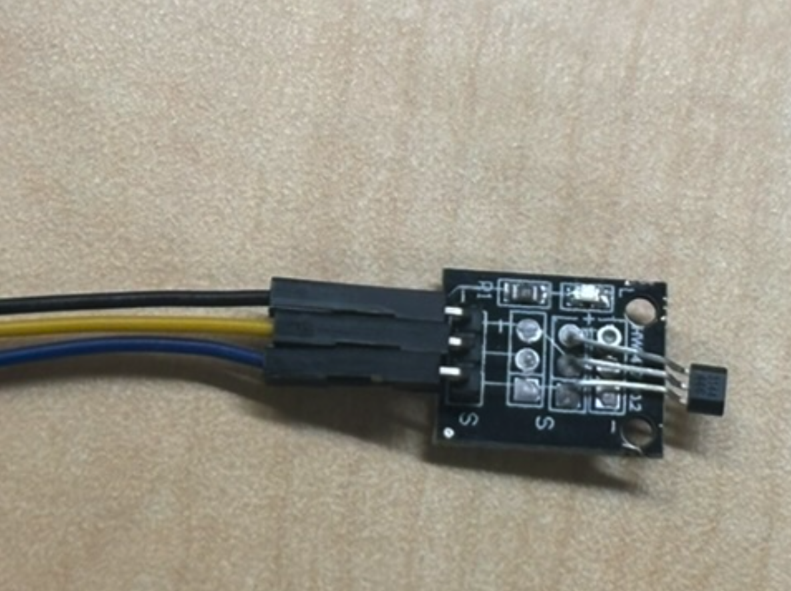 

2. Now connect the blue jumper wire (or whatever color you used) to the corresponding pin numbers (2, 3, 4, 5), and connect the purple jumper wire (buzzer) to pin number 6.

  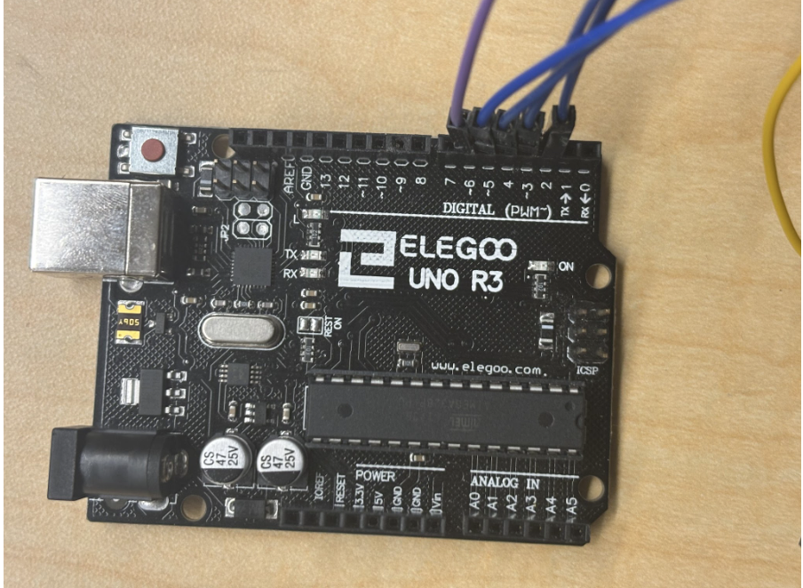 
 
3. Then, using the breadboard, align all the yellow jumper wires (power) on a single row and the black jumper wires (ground) on the row below.

  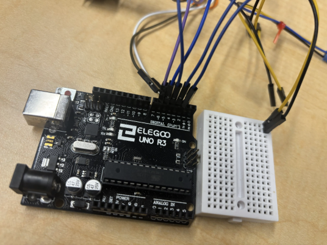 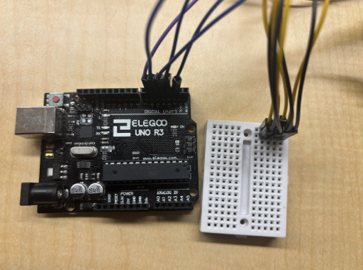 

4. If using the small breadboard, use two male-to-male wires to connect each row to the corresponding row next to it.

  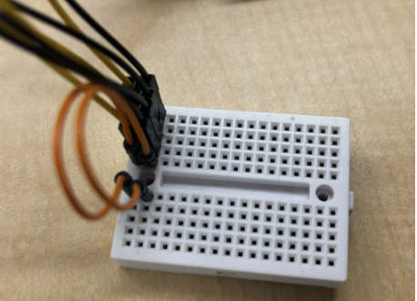 

5. Then connect the corresponding buzzer cable to power and ground. (In this case, power was connected through a white jumper cable and ground through a brown cable.)

  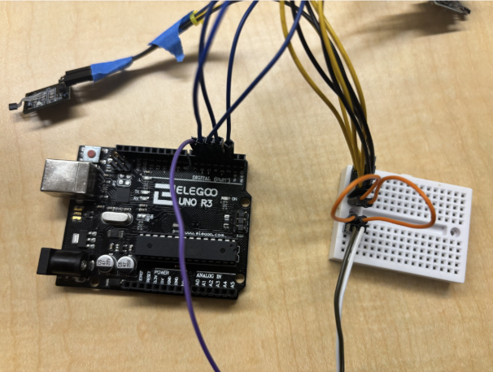 

6. Next, use male-to-male wires to connect one wire from the 5V pin on the Arduino board to the power row on the breadboard. Then connect another wire from the GND pin on the Arduino board to the corresponding ground row on the breadboard. (Red is power and green is ground.)

  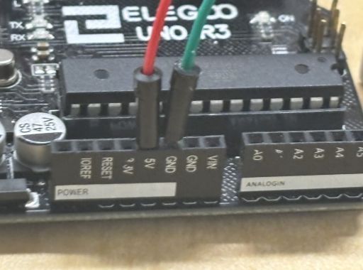 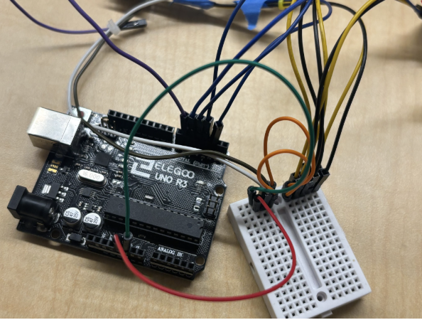 

7. Then move on to the Dual H-Bridge; connect IN1 and IN2 to the corresponding pin numbers on the Arduino board, which are pins 10 and 11. 

  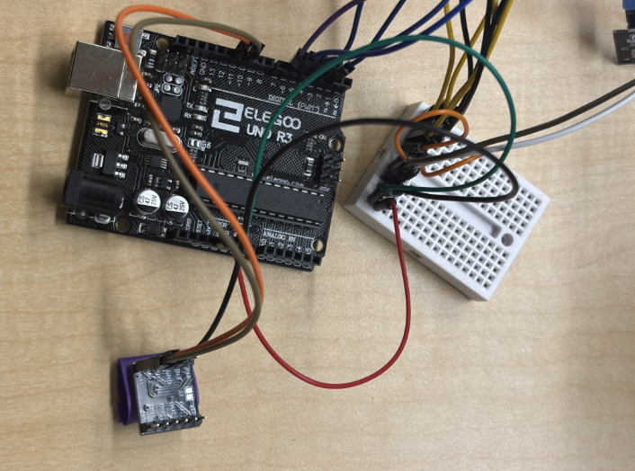 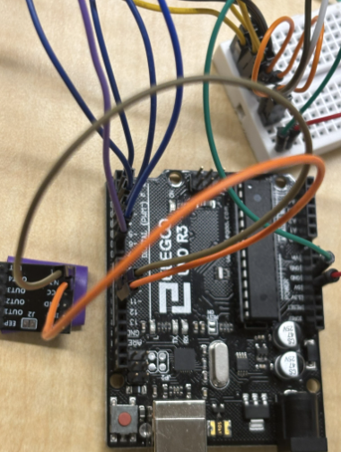 

8. Using another male-to-female connector, connect GND from the Dual H-Bridge to one of the spaces on the GND row of the breadboard.
9. Then, using 2 wires, carefully strip part of the insulation and wrap the exposed wire around the small flaps at the tip of the motor wire. Bonus points if you solder them together for a stronger connection.

  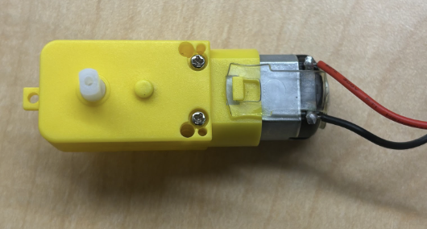 

10. Then use two female-to-female wires to connect the wires to OUT1 and OUT2, connecting the motor to the circuit. (It does not matter which wire goes where; it only determines the direction the motor spins.)

  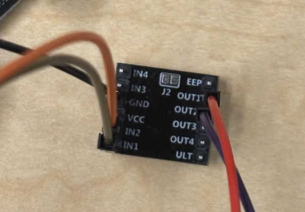  

11. Use an additional male-to-male wire to connect the designated ground row on the breadboard to an additional row on the breadboard (look at the image for an example; it is the blue wire).

  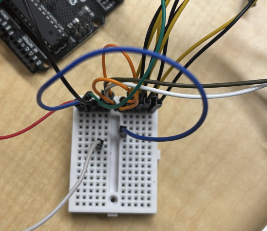 

12. Then connect the black wire of the 9V battery clip to the row connected to the GND of the Arduino board.
13. Using a male-to-female connector, connect the pin labeled EEP on the breadboard, then connect the red wire from the battery to it. 

  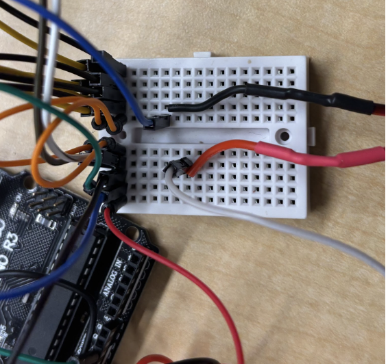 

14. To connect the LED, use a male-to-male connector to connect the LED pin number (in this case, pin 13) to an empty row on the breadboard. (This allows multiple LEDs to share the same pin without requiring additional programming or extra pin numbers.) 

  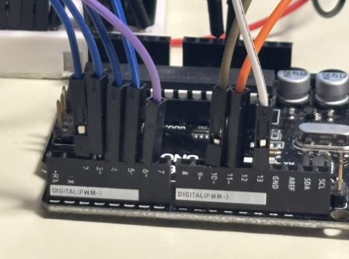 

15. Connect both LED pins to male-to-female jumper wires, making sure to remember which wire is connected to which leg. This gives the LEDs more flexibility in placement. 

  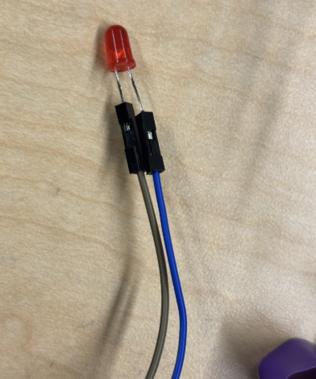 
 In this case, the blue wire is the longer leg of the LED, and the black wire is the shorter leg.
16. Then take a resistor and place one leg of the resistor into the row connected to the LED pin number and the other leg into the designated ground row on the breadboard. 

  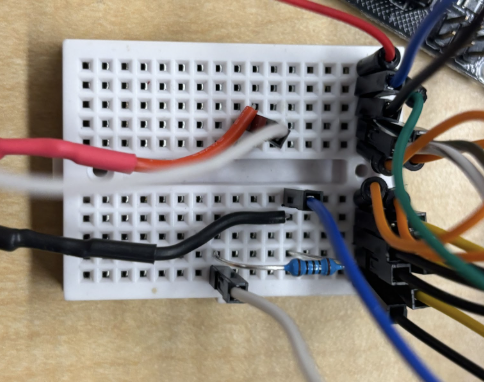 

17. Finally, connect the LED to both the designated ground row and the LED row. Connect the shorter leg (cathode) to the GND row and the longer leg (anode) to the row connected to the LED pin number.
18. After completing all circuit connections, connect the Arduino board to a computer using a USB cable.
19. Open the Arduino IDE and upload the pill dispenser code to the Arduino board. Make sure the correct board type and COM port are selected before uploading.
20. Once the code has successfully uploaded, disconnect the Arduino board from the computer if desired.
21. Once the code has successfully uploaded, disconnect the Arduino board from the computer
22. Connect the 9V battery to the battery clip to power the system. The Hall sensors, LEDs, buzzer, and motor should now receive power through the circuit.
23. Test the system by manually rotating or activating the motor and checking whether the Hall sensors correctly detect the magnets and stop the motor at the intended compartment positions. Also verify that the LEDs and buzzer respond correctly.
24. If the system does not behave as expected, recheck all wiring connections, sensor alignment, magnet placement, and uploaded code. Small changes in spacing or alignment may significantly affect Hall sensor detection accuracy.
25. Once testing is complete and the system functions correctly, secure loose wires and components to improve stability and reliability of the final setup. 

  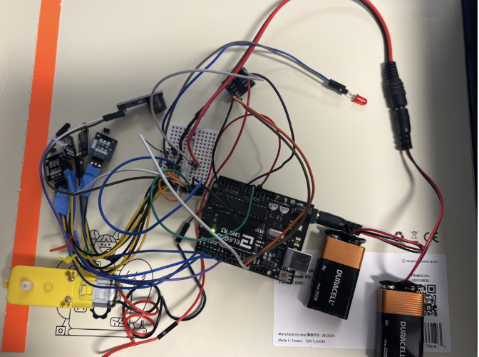 

Link to a presentation recording about our process:
https://drive.google.com/file/d/1hDMXnCrUFTzj-6_CXgaGcCLH1xbHkZQg/view?usp=sharing  
