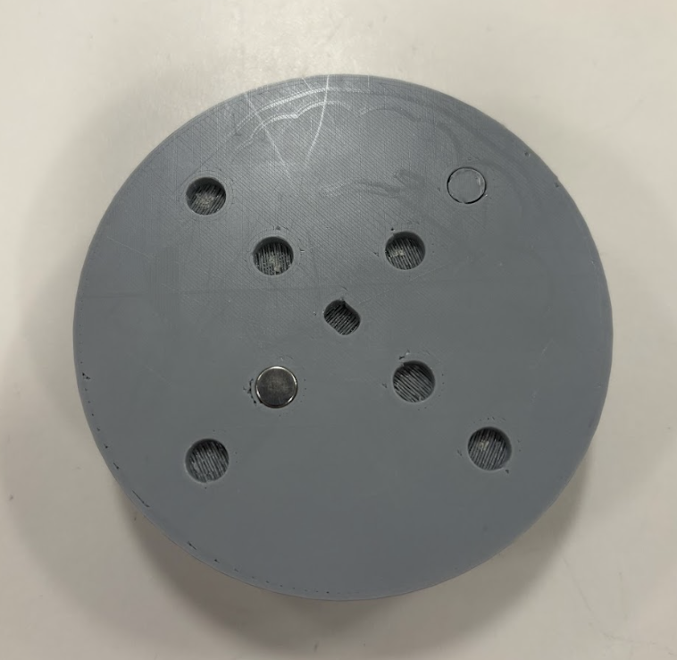
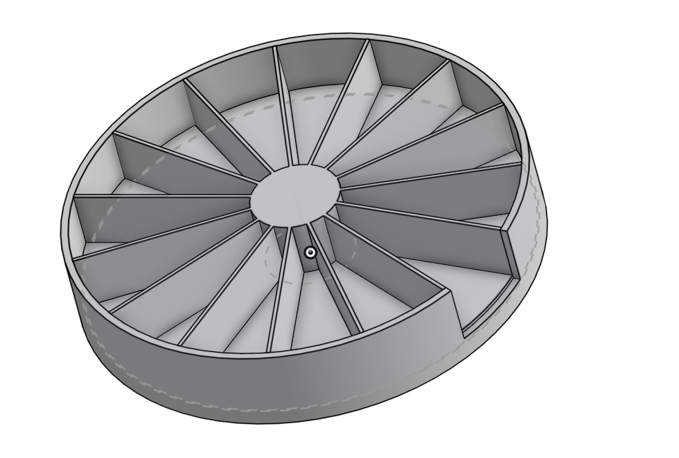
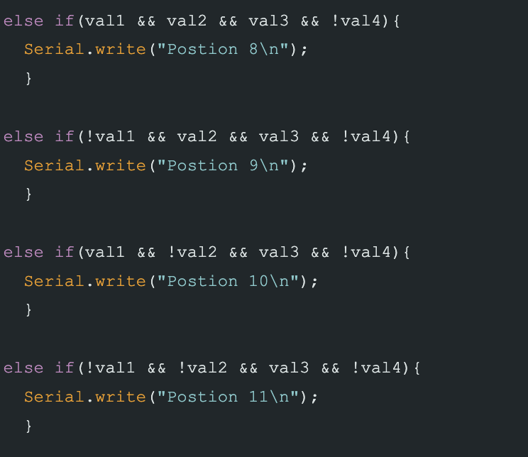
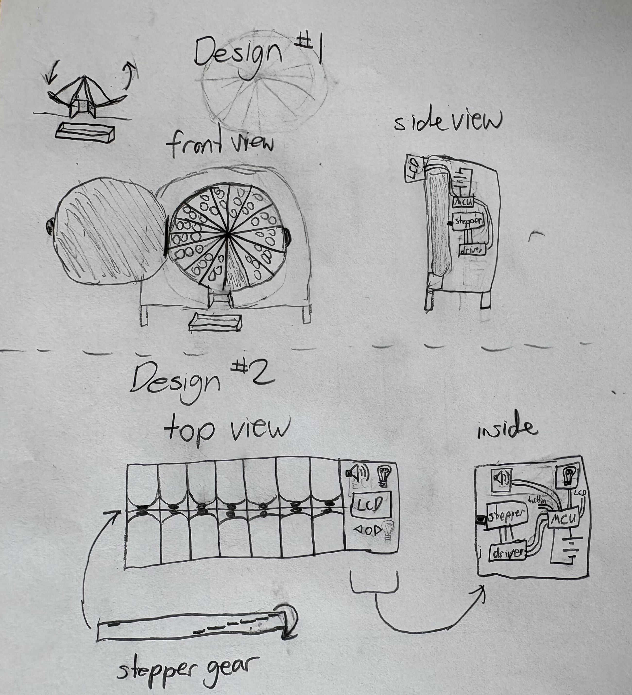
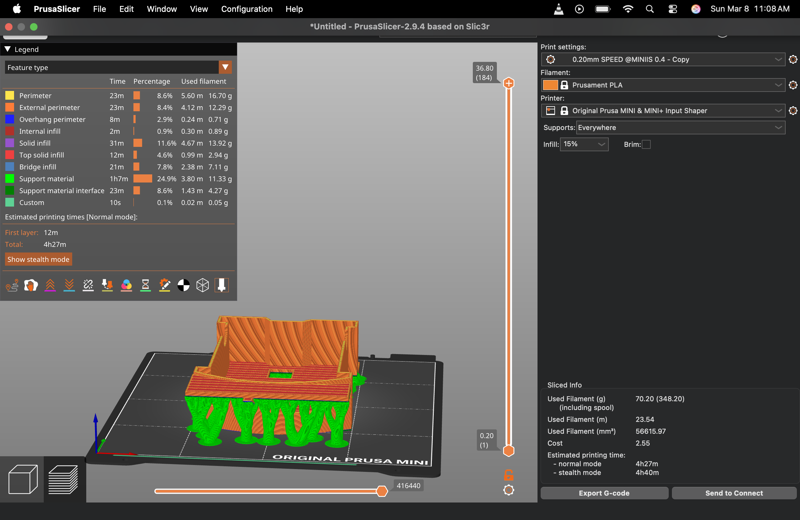
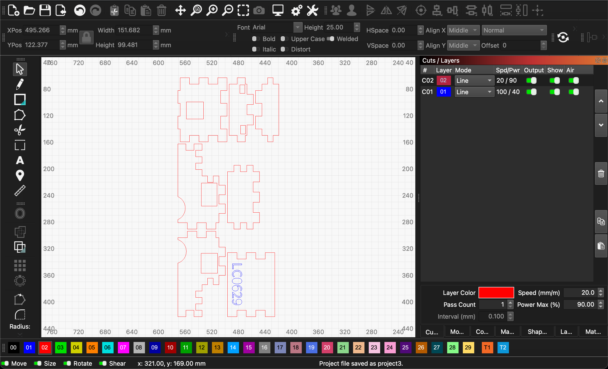
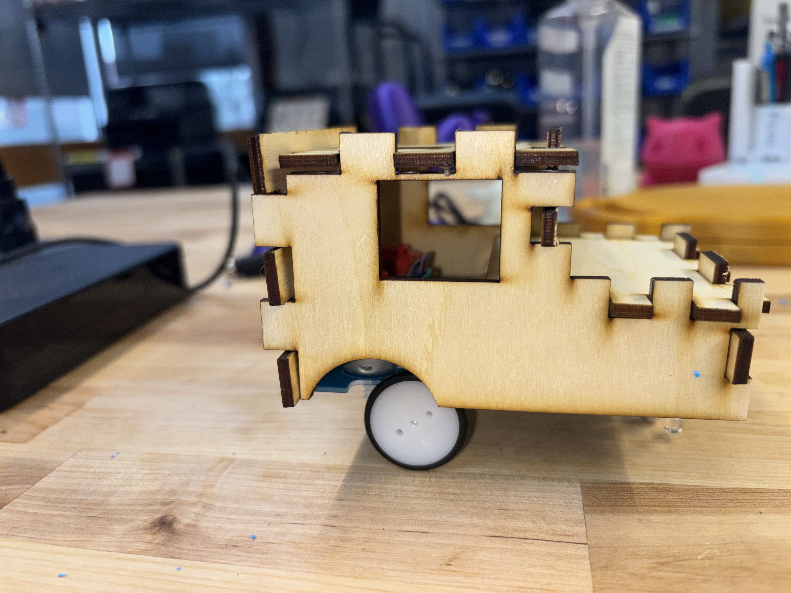
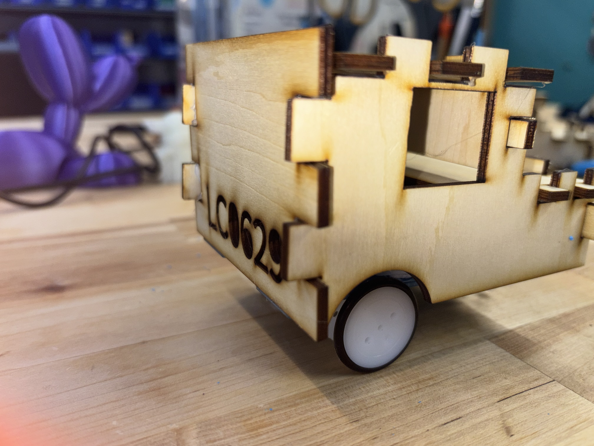
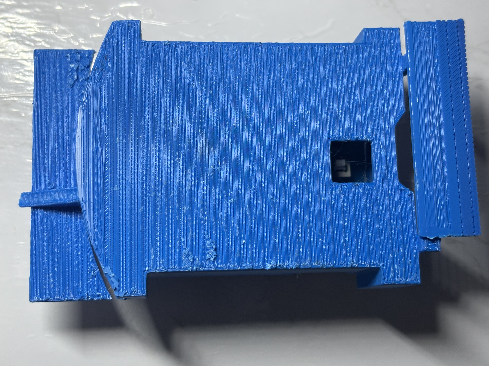

<!DOCTYPE html>
<!-- saved from url=(0047)https://gleverette.github.io/ENGR11A/prusa.html -->
<html lang="en">
    <head>
        <meta charset="utf-8" />
        <meta name="viewport" content="width=device-width, initial-scale=1, shrink-to-fit=no" />
        <meta name="description" content="" />
        <meta name="author" content="" />
        <title>Cycle Iterations</title>
        <!-- Favicon-->
        <link rel="icon" type="image/x-icon" href="assets/icon.jpg" />
        <!-- Custom Google font-->
        <link rel="preconnect" href="https://fonts.googleapis.com" />
        <link rel="preconnect" href="https://fonts.gstatic.com" crossorigin />
        <link href="https://fonts.googleapis.com/css2?family=Plus+Jakarta+Sans:wght@100;200;300;400;500;600;700;800;900&amp;display=swap" rel="stylesheet" />
        <!-- Bootstrap icons-->
        <link href="https://cdn.jsdelivr.net/npm/bootstrap-icons@1.8.1/font/bootstrap-icons.css" rel="stylesheet" />
        <!-- Core theme CSS (includes Bootstrap)-->
        <link href="css/styles.css" rel="stylesheet" />
    </head>
    <body class="d-flex flex-column h-100" style="background-color: #f6f1e7;">
        <main class="flex-shrink-0">
            <!-- Navigation-->
            <nav class="navbar navbar-expand-lg navbar-light py-3">
                

                    <a class="navbar-brand" href="index.html">
                        Portfolio
                    </a>
                    <button class="navbar-toggler" type="button" data-bs-toggle="collapse" data-bs-target="#navbarSupportedContent" aria-controls="navbarSupportedContent" aria-expanded="false" aria-label="Toggle navigation"></button>
                    

                        <ul class="navbar-nav ms-auto mb-2 mb-lg-0 small fw-bolder">
                            <li class="nav-item"><a class="nav-link" href="index.html" style="color: #B109C8;">Home</a></li>
                            <li class="nav-item"><a class="nav-link" href="resume.html" style="color: #B109C8;">Resume</a></li>
                            <li class="nav-item"><a class="nav-link" href="projects.html" style="color: #B109C8;">Projects</a></li>
                            <li class="nav-item"><a class="nav-link" href="contact.html" style="color: #B109C8;">Contact</a></li>
                        </ul>
                    

                

            </nav>
        
          <h2 style="font-family: 'Nunito'; font-weight: bold; text-align:center; padding-top:30px; color: #B109C8;">
          Cycle Process for Timed Pill Dispenser
          </h2>

        
                

                  

                  <h5 style="color: #AE15EB;" >
                    Our project addresses the challenge that older adults with dementia or memory-related conditions face when trying to manage their medications independently. Many struggle to remember when to take their pills or whether they have already taken them, which can lead to missed doses or double dosing. Based on this, our needs statement is that users require a system that not only organizes their medication clearly but also supports them in taking the correct pills at the correct time without relying heavily on a caregiver. To guide our design, we focused on three main principles: simplicity, reliability, and automation. The device must be easy to understand and use, consistently perform without errors, and reduce the need for memory through automated assistance. Success for our design would mean that the device can accurately stop at the correct compartment every time, dispense the correct pills, and remain easy for users to load and interact with. We plan to measure this through testing stopping accuracy, consistency over repeated rotations, and how easily a user can interact with the system. If the device does not meet these expectations, we will adjust key elements such as compartment spacing, magnet placement, or control logic to improve performance.
                  </h5>
                  
                  <!--<h5 style="color: #4109B5;">
                    The files for this project can be accessed through platforms such as <a href="https://3d.nih.gov/collections/prosthetics">NIH 3D Print Exchange</a>  and <a href="https://www.thingiverse.com/thing:1453190">(click here for link)</a>. Overall, locating the files is relatively straightforward, as it mainly involves searching for the design on a 3D printing database. However, when it comes to selecting the correct parts, the process becomes more complicated. The files are not clearly grouped or organized by sections, which makes it difficult to confirm whether all necessary components have been downloaded. For example, during assembly, my group realized we were missing smaller parts such as the whippletree. While this was manageable for us since it was a quick reprint, in situations where time or resources are limited, this could create a more significant issue.

                  </h5>
                  <h5 style="color: #4109B5;"> 
                    When it came to assembling the hand, we initially followed the official instructions provided through the <a href="https://3d.nih.gov/collections/prosthetics">NIH website</a>, along with supplementary videos created by other groups. While these resources were helpful, the process was still somewhat difficult to follow. I found that watching the videos alone was not enough, as I often had to pause and rewatch sections multiple times while working. To improve my understanding, I referred to an alternative step-by-step guide <a href = "https://cdn.thingiverse.com/assets/dd/6b/45/30/fc/Phoenix_v2_assembly_guide.pdf">alternative step-by-step guide</a> that included more detailed explanations and visual references. Although it did not cover every small step, it was easier to follow because the visuals helped fill in the gaps between instructions. Overall, the design itself is fairly accessible, as it is divided into smaller components and does not require a large printer to produce.
                    </h5>
              
 -->

               <h4 style="font-family: 'Nunito'; font-weight: bold; padding-top:10px; color: #B109C8;">
                    Cycle 1          </h4>
                    

                <figure style="float: right; width: 300px; margin: 0 15px 15px 0; text-align: center;">

                  

                  <figcaption style="font-size: 0.85rem; margin-top: 6px; color: #7A40ED;">
                    Figure 1: Printed 3d protype
                  </figcaption>

                </figure>
                  <h5 style="color: #AE15EB;" > 
                        The goal of this cycle was to create a simple physical prototype to test the core concept of a rotating pill dispenser. We wanted to understand how a circular compartment system behaves in terms of movement, spacing, and ease of access before committing to a more complex design.            
                        <ul style="list-style-type: circle;"> 
                            <li>Design initial compartment model in CAD </li>
                            <li> Keep design simple for fast prototyping</li>
                            <li>Observe structural stability and usability</li>
                            <li> Test rotation and accessibility of compartments</li>
                      </li>
                  </ul>
                 <strong> What We Actually Accomplished :</strong> We built a 4-compartment prototype to quickly test the idea without overcomplicating the design. This helped us confirm that a rotating system is practical and that users can access compartments easily. However, it also showed that fewer compartments limit functionality and that alignment between sections needs to be precise. This means our design direction is valid, but requires more compartments and improved accuracy for real use.
              </h5>

              <h4 style="font-family: 'Nunito'; font-weight: bold; padding-top:10px; color: #B109C8;">
                    Cycle 2 </h4>

                    

                <figure style="float: right; width: 300px; margin: 0 15px 15px 0; text-align: center;">

                  

                  <figcaption style="font-size: 0.85rem; margin-top: 6px; color: #7A40ED;">
                    Figure 2: Final 3d Design for pill dispenser
                  </figcaption>

                </figure>
                  <h5 style="color: #AE15EB;" > 
                    The goal of this cycle was to refine the design by expanding it into a full 15-compartment system, while also planning for features like day/night separation and a refill section. We also aimed to incorporate a stopping mechanism into the structure itself.
                        <ul style="list-style-type: circle;"> 
                            <li>Redesign model with 15 compartments </li>
                            <li>Include center section for magnet placement</li>
                            <li>Ensure equal spacing for accurate rotation</li>
                            <li> Evaluate design feasibility</li>
                      </li>
                  </ul>
                 <strong> What We Actually Accomplished :</strong> We completed a detailed 15-compartment CAD design with evenly spaced sections and a designated refill slot. We also added central holes for magnets, which are critical for controlling where the system stops. While it hasn’t been printed yet, this step is important because it translates the concept into a design that can support automation and precise positioning.
              </h5>
                     
            <h4 style="font-family: 'Nunito'; font-weight: bold; padding-top:10px; color: #B109C8;">
                    Cycle 3          </h4>
                    

                <figure style="float: right; width: 300px; margin: 0 15px 15px 0; text-align: center;">

                  

                  <figcaption style="font-size: 0.85rem; margin-top: 6px; color: #7A40ED;">
                    Figure 3: Arduino sample code
                  </figcaption>

                </figure>
                  <h5 style="color: #AE15EB;" > 
                       The goal of this cycle was to develop and validate the control system that will allow the pill maker to stop at the correct compartment. This involved creating an Arduino-based mechanism that can detect magnets and use that signal to control motion, ensuring accurate positioning for dispensing.
            
                        <ul style="list-style-type: circle;"> 
                            <li>Write Arduino code for magnet detection</li>
                            <li> Test sensor response to magnets</li>
                            <li>Integrate stopping logic into code</li>
                            <li> Prepare motor connection setup</li>
                            <li> Test system behavior (code + detection) </li>

                  </ul>
                 <strong> What We Actually Accomplished :</strong> We developed Arduino code that successfully detects the presence of a magnet and triggers a stop condition. This is a critical step because it establishes how the system will know when it has reached the correct compartment. Although the code has not yet been physically connected to the motor, it confirms that our approach to position control is viable. This directly supports the overall design by ensuring that each compartment can be aligned consistently, which is necessary for reliable dispensing.
              </h5>

            <h4 style="font-family: 'Nunito'; font-weight: bold; padding-top:10px; color: #B109C8;">
                    Cycle 4          </h4>
                   <!--< 

                <figure style="float: right; width: 300px; margin: 0 15px 15px 0; text-align: center;">

                  

                  <figcaption style="font-size: 0.85rem; margin-top: 6px; color: #7A40ED;">
                    Figure 1: Both main ideas sketched out
                  </figcaption>
              </figure> -->
                  <h5 style="color: #AE15EB;" > 
                        The goal of this cycle is to integrate all components into a complete working system and evaluate its real-world performance. This includes assembling the 15-compartment model, connecting the motor and Arduino system, and testing how accurately and reliably the device rotates and stops at each compartment.            
                        <ul style="list-style-type: circle;"> 
                            <li>3D print final 15-compartment model</li>
                            <li>Insert magnets into center holes</li>
                            <li>Assemble motor with rotating base</li>
                            <li>Connect Arduino to motor system</li>
                            <li>Test full rotation and stopping accuracy</li>
                            <li>Evaluate durability and material performance</li>

                  </ul>
                 <strong> What We Actually Accomplished :</strong> This cycle is not fully completed yet, but significant progress has been made toward integration. We have a finalized design, a working detection system, and a clear assembly plan. The remaining step is to physically connect the motor and test the system in motion. Completing this cycle will allow us to verify if the design works as intended under real conditions, particularly in terms of stopping accuracy, consistency, and durability, which are essential for the device to function as a dependable pill dispenser.
              </h5>

<h4 style="font-family: 'Nunito'; font-weight: bold; padding-top:10px; color: #B109C8;">
                    How the Design Solves the Problem </h4>
<h5  style="color: #AE15EB;">
Our design was built from the ground up to directly reflect these needs and principles. The pill maker features a 15-compartment rotating system, with 14 compartments designated for daily and nightly medications and one additional compartment serving as a refill or reminder section. This structure allows users to organize their medication clearly over a full cycle, reducing confusion and supporting routine. To address reliability, we designed the inner core to include precisely placed magnets, which work with an Arduino-controlled sensor to detect position and stop the rotation at the correct compartment. This ensures that the system can consistently align with the intended section for dispensing. The use of a motor to drive rotation introduces automation, allowing the device to move on its own rather than relying on the user to manually track positions. Additionally, the circular layout promotes ease of access and intuitive use, as each compartment follows a predictable sequence. Together, these features create a system that not only organizes medication but actively supports correct usage, helping users maintain independence while reducing the risk of errors. </h5>

             

         <!-- Bootstrap CSS -->
<link href="https://cdn.jsdelivr.net/npm/bootstrap@5.3.2/dist/css/bootstrap.min.css" rel="stylesheet">

<!--<h5 class="clickable-heading"
    style="margin-left:100px;"
    data-bs-toggle="modal"
    data-bs-target="#pics">
    Click here to see settings of design
</h5> -->

<!-- Modal -->

  

    

      

        <h5 class="modal-title">Settings</h5>
        <button type="button" class="btn-close" data-bs-dismiss="modal"></button>
      

      

        

          

            
            
Setting of Car design in PRUSA Slicer

          

          

            
            
Setting of Car deign in LightBurn 

          

          

            
            
Laser Print Car Cover

          

          

            
            
Laser Print Car Cover

          

        

            
            
Result of UnderExtrusion

          
 
        

      

    

  

<!-- Bootstrap JS -->

    
    
        <main class="flex-shrink-0"> 

        </main></body><grammarly-desktop-integration data-grammarly-shadow-root="true"><template shadowrootmode="open">

</template></grammarly-desktop-integration></html>